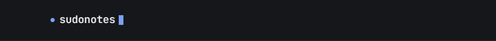

# sudonotes

A lightweight, local-first Markdown notebook for **AI prompts** and **ideas**.

[](https://snapcraft.io/sudonotes)
[](https://opensource.org/licenses/MIT)
[](https://github.com/mory-dev/sudonotes/releases/latest)

[Website](https://sudonotes.com) · [Documentation](https://sudonotes.com/docs) · [Downloads](https://sudonotes.com/download)

---

## Install

### Windows

<a href="https://apps.microsoft.com/detail/sudonotes">
  
</a>

Or install with the Windows Package Manager (`winget`):

```powershell
winget install sudonotes
```

Standalone installer: [sudonotes for Windows (x64)](https://sudonotes.com/downloads/sudonotes_0.3.5_x64-setup.exe).

### Linux

<a href="https://snapcraft.io/sudonotes">
  
</a>

```bash
sudo snap install sudonotes
```

Or configure the signed **APT repository** (Ubuntu 22.04+ / Debian):

```bash
sudo install -m 0755 -d /etc/apt/keyrings
curl -fsSL https://sudonotes.com/apt/key.asc | sudo gpg --dearmor -o /etc/apt/keyrings/sudonotes.gpg
echo "deb [signed-by=/etc/apt/keyrings/sudonotes.gpg] https://sudonotes.com/apt stable main" | sudo tee /etc/apt/sources.list.d/sudonotes.list
sudo apt update && sudo apt install sudonotes
```

---

LLM prompts end up scattered across chat histories, scratch files, and half-abandoned Notion pages. They get rewritten from scratch instead of refined. sudonotes keeps them in one place, links them to the ideas that motivated them, and finds them again instantly.

- **Local-first.** Your notes are plain Markdown files in a folder you choose. No account, no sync, no lock-in.
- **Lightweight.** Built with Tauri — the installer is ~20MB and it uses your system's webview instead of shipping a browser.
- **Fast search.** SQLite FTS5 over every note. `Ctrl+K` from anywhere.
- **Linked.** Wiki-style `[[links]]` with backlinks, so prompts and the ideas behind them stay connected.
- **Shippable.** Turn an idea bubble into a GitHub issue, and watch it retire itself when the issue closes.
- **Open source.** MIT.

AI assistance can analyze prompt/model fit, suggest refinements, and add tags. It is on by default and needs no API key of your own — requests go through the sudonotes API, which holds the provider key. Enabling it sends the note's content to that service; turn it off per vault to keep note content local. Note bodies are never logged by the sudonotes proxy, and a failed automatic-tag request can fall back to a local keyword pass.

## Project linking and IDEAS.md

Link an idea to a software project and sudonotes mirrors it to `IDEAS.md` in
the project root. The vault note remains the canonical copy, and every save
refreshes the mirror so people and local coding agents can find the context next
to the code.

In a Git repository, sudonotes adds `IDEAS.md` to `.gitignore`. If the project
already has that file, the app asks whether to import it into the idea or replace
it instead of silently overwriting it.

[Read the project-linking and IDEAS.md guide](https://sudonotes.com/docs/project-linking/).
[Learn how to structure IDEAS.md for a local LLM or coding agent](https://sudonotes.com/docs/ideas-md-for-llms/).

## GitHub issues from idea bubbles

When a linked project is a GitHub repository, any idea bubble can become an issue
without being retyped. The bubble keeps a reference to the issue it became, and
once that issue closes the bubble dims — optionally deleting itself, off by
default.

The draft is written from your own words: a model may add a title and a sentence
of context, but the bubble's text is reproduced verbatim, and the app restores it
if the model paraphrases. The bubble's tags become labels on the issue.

Issues are created **by your own account** using GitHub's device flow. The
sudonotes GitHub App asks only for **Issues** (read & write) and **Metadata**
(read) on the repositories you pick — it cannot read your code. The token is kept
in your operating system's credential store, never in the vault.

[Read the GitHub issues guide](https://sudonotes.com/docs/github-issues/).

## Vault layout

A vault is just a directory:

```
<vault>/
  prompts/**.md
  ideas/**.md
  .sudonotes/index.db        # search index — a cache, rebuilt on launch
  .sudonotes/settings.json   # whether AI is on for this vault
  .sudonotes/github.json     # whether closed issues delete their bubble
  .sudonotes/blackhole.md    # scratch dump — not a note, created on first save
```

Deleting `.sudonotes/` drops the index (rebuilt on launch), the AI preference
(back to on), and the Blackhole dump. Prompts and ideas are the `.md` files
under `prompts/` and `ideas/`. No credentials are ever written there.

Each note is Markdown with a small YAML frontmatter block (`id`, `title`, `tags`, `created`, `updated`). Edit them in any editor you like; sudonotes picks up external changes automatically.

## Writing a note

Two pieces of syntax do most of the work. Both are ordinary text, so a note that
uses them is still readable in any editor.

### `{{placeholders}}` — prompts as templates

Anywhere a prompt has a value you swap out each time, write it as
`{{name}}`:

```markdown
Review this {{language}} pull request for {{concern}}.
Be concise and cite line numbers.
```

The editor highlights each one, and the right panel turns every distinct
placeholder into a field. Fill them in and **Copy filled** puts the finished
text on your clipboard — the note itself is never rewritten, so the template
stays a template. A placeholder you leave blank is copied through as
`{{name}}`, so a half-filled prompt still shows what is missing rather than
silently going out with a hole in it.

Names are free text and matched literally: `{{language}}` and `{{ language }}`
are the same placeholder, `{{Language}}` is a different one.

### `[[links]]` — connecting notes

Write `[[Note title]]` to link one note to another:

```markdown
Drafted from [[Prompt library]] while working through [[AI fridge]].
```

The brackets are hidden while you read and reappear when the caret enters the
link, so a linked note reads as prose rather than markup. `Ctrl+click` opens the
target. If no note by that title exists yet, following the link offers to create
it.

To label a link differently from its target, use `[[Target|what to show]]`.

The **Linked from** panel lists every note pointing at the one you have open,
which is what to check before renaming or deleting something.

Selecting a word and pressing `[` wraps it, one bracket per press — so `[` twice
gives you a link — and `Backspace` peels the levels back off one at a time.

### `((references))` — jumping within a note

Type `((` to reference another section of the same note — a heading or bubble:

```markdown
See ((The cutover plan)) below for the steps.
```

The parens hide while you read, exactly like wiki-link brackets, and a click
smooth-scrolls to that section, glows it briefly, and offers a subtle **Back**
pill that returns you to where you jumped from. A long heading can be matched by
a short, distinctive prefix, so a reference never has to repeat the whole line.

### Keyboard

| | |
| --- | --- |
| `Ctrl K` / `Ctrl F` | Search every note |
| `Ctrl Shift F` | Find within the open note |
| `Ctrl N` | New note, of whatever type you are looking at |
| `Ctrl S` | Flush the pending save (saving is automatic) |
| `Ctrl A` | Select the current bubble in an idea; on a blank separator, select the whole note |
| `Ctrl` `+` / `-` / `0` | Scale the interface |
| `Ctrl Enter` | From a prompt in a collection, back to the collection |

[See the complete context-aware shortcut reference](https://sudonotes.com/docs/shortcuts/).

## Backups

sudonotes keeps compressed snapshots of the vault **outside** it, in the app's
own data directory — the point being to survive the vault folder itself being
deleted:

| | |
| --- | --- |
| Windows | `%APPDATA%\com.sudonotes.app\backups\` |
| macOS | `~/Library/Application Support/com.sudonotes.app/backups/` |
| Linux | `~/.local/share/com.sudonotes.app/backups/` |

One runs when a vault opens, at most once every six hours, and the twenty most
recent are kept. The settings dialog has the switch, the folder path, and a
**Back up now** button.

To recover, use **Restore a backup…** in the same dialog: pick the `.bak`, pick
an **empty** folder to unpack it into, and sudonotes offers to open the result
as your vault. Restoring refuses any folder that already has something in it, so
a recovery can never land on top of notes you still have — your current vault is
never written to.

Failing that, each archive is an ordinary ZIP despite the extension: rename it to
`.zip`, unpack it into an empty folder, and open that folder as a vault. The
`prompts/` and `ideas/` trees inside are exactly as they were, and nothing else
in the archive is needed.

[Read the full backup and recovery guide](https://sudonotes.com/docs/backups-and-recovery/).

## Repository

| Directory | What it is |
| --- | --- |
| `core/` | `sudonotes-core` — the note format: frontmatter, filenames, links, paste splitting. Pure Rust, no filesystem, and it compiles to WebAssembly so a browser build can share it. |
| `app/` | The desktop app. React front end in `src/`, Tauri and the filesystem in `src-tauri/`. |
| `worker/` | The Cloudflare Worker behind `api.sudonotes.com`, which holds the AI provider key. |
| `site/` | sudonotes.com — Astro, static. |

The split between `core/` and `app/src-tauri/` is deliberate and worth
preserving: a vault is a folder that more than one program will eventually write
into, and anything defining how a note is stored belongs in `core/` so those
programs cannot disagree.

## Development

Requires [Node.js](https://nodejs.org) and [Rust](https://rustup.rs), plus the [Tauri system dependencies](https://tauri.app/start/prerequisites/) for your platform.

```bash
cd app && npm install && npm run tauri dev
```

Run the Rust tests:

```bash
cargo test --manifest-path core/Cargo.toml && cargo test --manifest-path app/src-tauri/Cargo.toml
```

Check that the core still builds for the browser:

```bash
cargo check --manifest-path core/Cargo.toml --target wasm32-unknown-unknown
```

Build a release installer:

```bash
cd app && npm run tauri build
```

## Status

Early. The core loop — capture, link, search — is in place, along with project-folder linking,
collection splitting, in-page references, automatic backups, and per-note model assignment. A
browser build that connects to the same vault, and vim keybindings, are planned.

## License

MIT
